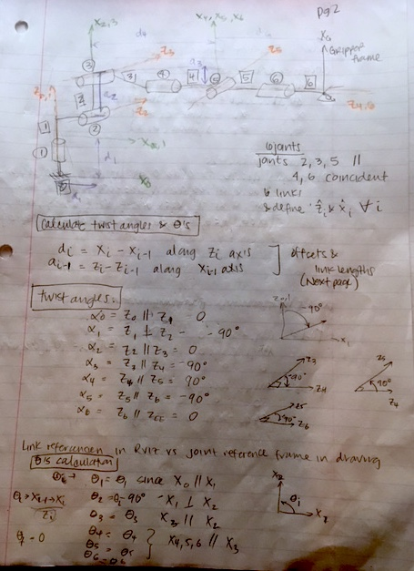
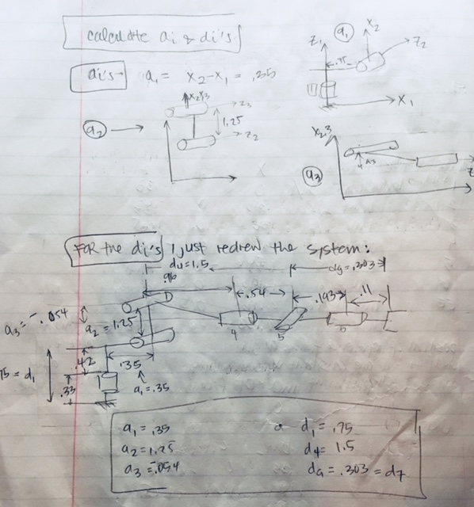
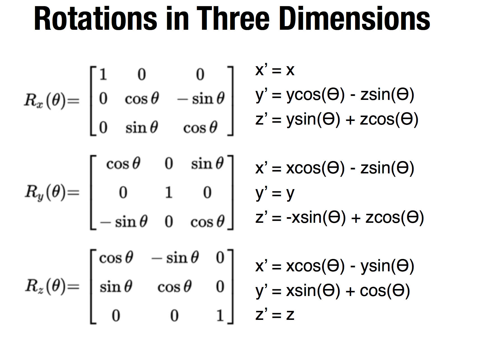
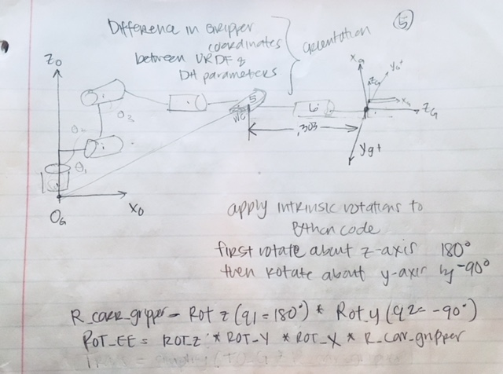
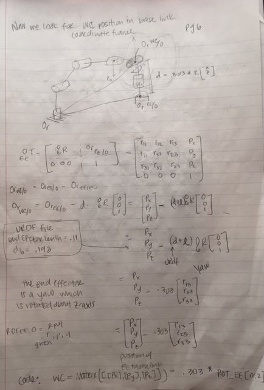
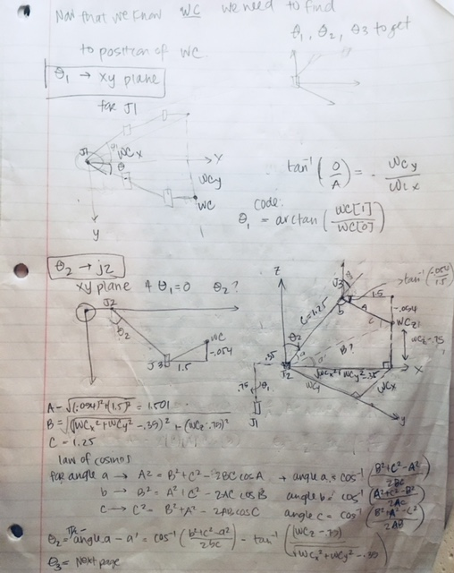
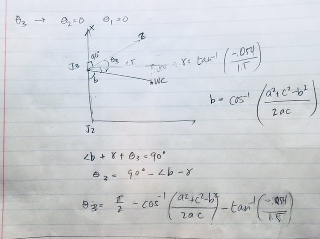
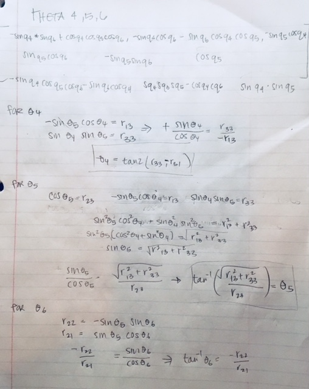

# RoboND-Kinematics-Project (April 2018)
## Project: Pick and Place project for RoboND Term 1
### Divya Patel (OptimomEngineer)
---

[//]: # (Image References)

[image1]: ./misc/Kuka_arm_image_1.png
[image2]: ./misc/Kuka_wire_model.png
[image3]: ./misc/Kuka_arm.png 
[image4]: ./misc/RotationMatrices_xyz.png
[image5]: ./misc/Rotation_Matrix_forTheta456.png
[image6]: ./misc/gripper_frame_DHparametersvsURDF.png
[image7]: ./misc/IK_debug_results_image.png
[image8]: ./misc/rviz_screen_image.png
[image9]: ./misc/DHParameters.png
[image10]: ./misc/page2.JPG
[image11]: ./misc/page3.JPG
[image12]: ./misc/page6.JPG
[image13]: ./misc/page5.JPG

This is the Udacity Kinematics Project for Term 1 of the Sofware Robotics Nanodegree Program. 

**The goals / steps of this project are the following:**
1) **Forward Kinematics Model** The first purpose of the project was to calculate the forward kinematic model

2) **Inverse Kinematic model** The IK model allowed the robot to identify location of an object on a shelf, approach and pick up object, calculate a trajectory path to a destination (a bin in this case) and follow the path to drop object in bin. The success metric was 8/10 on object identification, pick up and place in bin. The object appeared in at each attempt randomly at 9 different shelf locations.

![Robot Model][image1]

Above you can see the environment the kuka arm was located in as well as the shelf, the cylindrical object that the Kuka Arm is currently dropping into the bin.

I also wanted to see how the URDF file saw the joints and links and so I have included here what helped me understand the robot using the wire image.
![Wire Image Robot Model][image2]

**PART ONE**
#### Forward Kinematics
In order to calculate the forward kinematics, I created a table similar to this one from the URDF files. (all Pen and Paper images can be seen in the MISC file). The pen and paper for this is page 1.
![KR210 Manipulator][image3]

The sum of the z column = 1.946 which matches the RVIZ end data in the link table. Therefore, the position of the reference frame origin are consistent with the cummulative displacement in the URDF files. 

In order to make a DH parameter table for the Forward kinematics, I drew out on pen and paper the model using the URDF values for the joints and calculated or found the twist angles(alpha), theta values, d and a values for the z-axis and x-axis respectively. 

![DH Parameter Table][image9]

I created the symbols in the IK_server.py script file and filled out a DH parameter table. I used the DH parameter table to sub in for transformation matrices for each joint/link pair.

In order to get the Px, Py and Pz for the spherical wrist, I wanted to use the transformation matrices to create the rotational matrices and then applied an error correction.

Here I calculate the error correction between the URDF file and the DH parameters I calculated.

Here I find the WC using the rotational end effector matrix: 

**PART TWO**
#### Inverse Kinematics
The inverse Kinematics model is done by solving for 6 joint angles in order to manipulate the arm.
In the following image I show how I calculated and found Theta1, theta2, and theta3 for the inverse wrist center position for the Kuka Arm. 

Finally I found the inverse orientation angles for the end effector using the rotational matrix and using trigonometric properties to solve for theta4, theta5 and theta6. 

Here is the matrix I extracted using the print method in the code.
![Rotation Matrix for Theta4, theta5, theta6][image5]

Using this matrix, I calculated the theta values to obtain the final orientation for the kuka end effector.

Testing out the code, I found my errors to be OK. I hope to improve on the coding to help reduce the error. I did test the math on the robotic arm in simulation and found I occasionally had trouble with the path to the bin for the cylinders placed on the top shelf.
![Errors][image7]
Overall a fun project and would like to refine and reduce my errors more as I learn.

